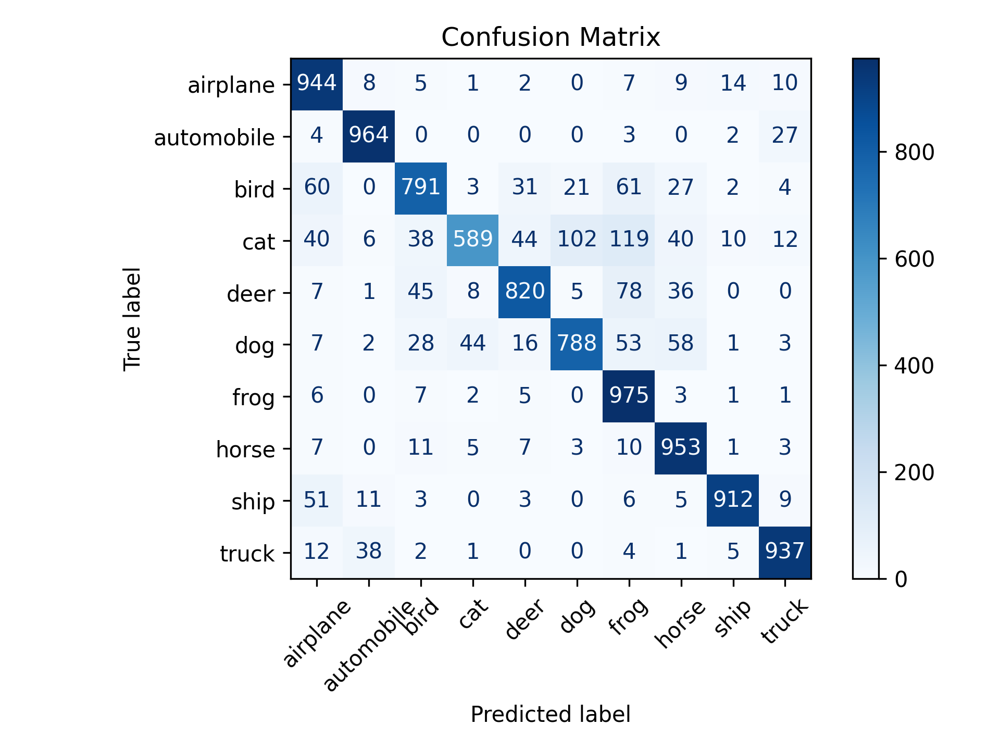
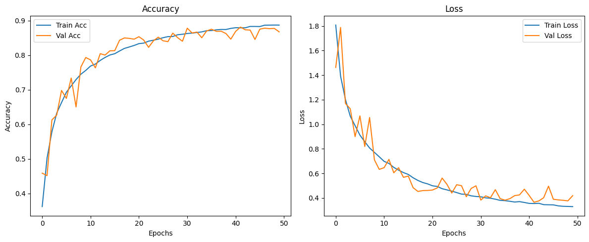

# 🧠 CIFAR-10 Image Classification using CNN

This project implements a custom Convolutional Neural Network (CNN) using TensorFlow/Keras to classify images in the CIFAR-10 dataset.

---

## Features

- Custom CNN with BatchNormalization and Dropout
- Trained on 10 classes of CIFAR-10 dataset
- Achieved up to 87% test accuracy
- Visualizations:
  - Training Accuracy & Loss
  - Confusion Matrix
  - Classification Report

---

## Results

### Confusion Matrix  


### Training Curves  


---

## How to Run

1. Clone this repo:
   ```bash
   git clone https://github.com/yourusername/cifar10-cnn.git
   cd cifar10-cnn
   
2. Install dependencies:
   ```bash
   pip install -r requirements.txt
3. Run the notebook:
   Open cifar10_cnn.ipynb using Jupyter or Colab
